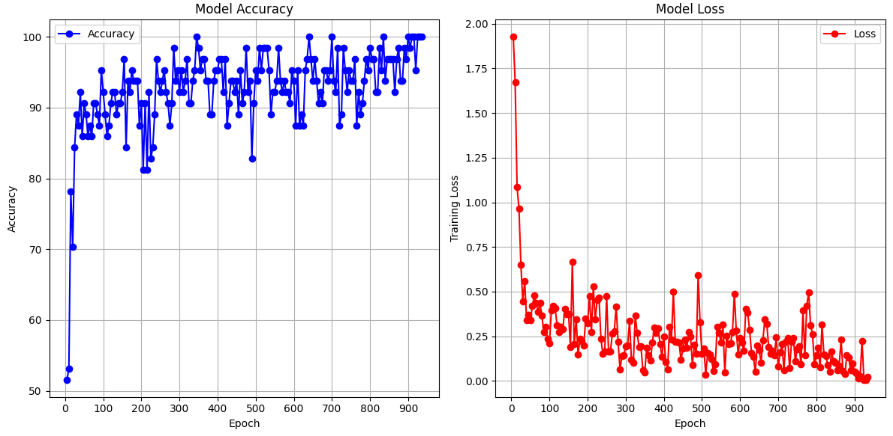

# MLP-pattern-recognition
### Model
- **Model:** Feed-Forward Neural Network,
- **Optimizer:** Adam optimizer,
- **Regularization methods:** Early stopping & Dropout.

## Introduction
The aim of this project was, using a very simple Feed-Forward Neural Network and Adam optimizer, to firstly get a good accuracy on MNIST database. This was a success, therefore the aim became to implement an interface so the user could draw numbers and as the NN to guess. I used exclusively the slides of UToyko's Advanced Data Analysis class by *Takashi Ishida* (ishi@k.u-tokyo.ac.jp) for my code and understanding, with a hand from chatGPT for giving readMNIST, reverseInt (Big-endian to Little-endian conversion) and read/write files functions.

### Why C++ ?
- Firstly, I used C++ because I'm much more familiar with it than Python. I was also interested to challenge myself to see if I could build a neural network from scratch, without pytorch or similar libraries.
- Secondly, I planned to use "SFML", a graphic library (with which I've done many projects), to ask the user to draw a number, and ask the MLP to output its guess.

## Demo

Training preview:


Test preview:


## Methodology
Firstly, I created the Matrix class to handle operations and vectors. From then on:
- Creation the DenseBlock class. I chose to put biases inside the weight matrices, and to initialise the weight matrices already transposed.
- Creation the MLP class, and implementation of the forward pass with softmax activation at the end.
- Implemented backpropagation using matrix operations and maths.
- Addition of Adam optimizer as detailed in the class. I used the same constants, and added a small coefficient ```1e-8``` in the expression of $$w_{ij}^{l+1}$$, such that $$\frac{1}{\sqrt(\hat{v})} \longrightarrow \frac{1}{\sqrt(\hat{v}) + 10^{-8}}$$ in case $$\sqrt(\hat{v})$$ is null.
- Creation of TrainerClassifier to train the Neural Network.

After implementing these classes and having a good accuracy on MNIST database, I've implemented the SFML library to create a drawing canva.


### Hyperparameters
- I used a learning rate of $$10^{-3}$$. It gave good results compared to 0.01.
- There's two layers of 256 and 128 neurons.
- In Adam optimizer, $$\beta_m = 0.9$$ and $$\beta_v = 0.999$$.
- I used batches of **32 images**, and used it on the whole dataset. It worked better than 16 or 64. Since the **MNIST** dataset has 60000 training images, we had $$60000/32 \approx 1850$$ epochs. I'm not sure that's how epochs work, but for my test it worked well like this !
- If early stopping is toggled, patience $$= 150$$. Below gives bad results and stops the learning too early.

## Results

### Observations
- Results on MNIST train database. When ran into the whole training database, the model gives the following results:


Here, values are plotted each 20-or-so epochs, otherwise my computer would take too much time to compute, and we couldn't see anything. We can see the training loss, and accuracy for each epochs.

- Results on MNIST test database:

After training on the whole train database, the model provides an accuracy of $$96.779$$ when tested on MNIST database's test files.

### Discussion
- As we can see of the plots, the accuracy rises quite quickly, before settling. This could mean that the model doesn't have to be ran this long to get a good accuracy.
- Also, the tests runs well on MNIST database, but when drawing numbers, the accuracy drops. This could be because the numbers of the database used for training are all centered, and that the way they were generated was different than mine. I tried to implement a gradient around the brush to fit the MNIST database-style and it gave better results, but it wasn't enough.

### Next steps
- I didn't implement flooding. Maybe that it could help.
- My next move will be to implement CNN to solve this problem. When writing by hand it doesn't give satisfying results (clearly above 50% but clearly below 60%).


---

## How to Use

- Run the ```main.exe``` file.
- To plot the output of the training, run the ```plot.py``` file

To change the hyperparameters except boolean ```training```, you must recompile everything for now. The command to compile is: ```mingw32-make -f MakeFile```.


## Requirements

- Mingw32 compiler version ```gcc-14.2.0-mingw-w64ucrt-12.0.0-r2```.
- Python 3.x .

---

## Repository Structure

```plaintext
NeuralNetwork/
│
├── model_save/        # Save of the model just in case
│   ├── model_weights.txt
│   └── training_data.csv
│
├── database/       # Dataset
│   └── MNIST/
│
├── libs/          # SFML Library used for the window
│   ├── include/
│   └── lib/
│
├── Neural_Network/     # Main codes of the repository
│   ├── DenseBlock/
│   │   ├── DenseBlock.cpp
│   │   └── DenseBlock.h
│   ├── MLP/
│   │   ├── MLP.cpp
│   │   └── MLP.h
│   ├── TrainerClassifier/
│   │   ├── TrainerClassifier.cpp
│   │   └── TrainerClassifier.h
│   ├── Utilities/
│   │   ├── functions.cpp
│   │   ├── functions.h
│   │   ├── Matrix.cpp
│   │   └── Matrix.h
│   │
│   ├── main.cpp        # Main code that initiate all variables
│   └── plot.py         # Run "py Neural_Network/plot.py" to get a plot of the result of the training
│
├── main.exe            # Run "start main.exe" to test the NN
├── MakeFile
├── model_weights.txt   # Save of the weights. Used to run the program without having to train it everytime
├── output.png
├── README.md
├── sfml-x.dll      # SFML Library used for the window
├── testing.gif     # Training example
├── training.gif    # Testing example
└── training_data.csv   # Output from the training process, to plot the loss and accuracy
```

---